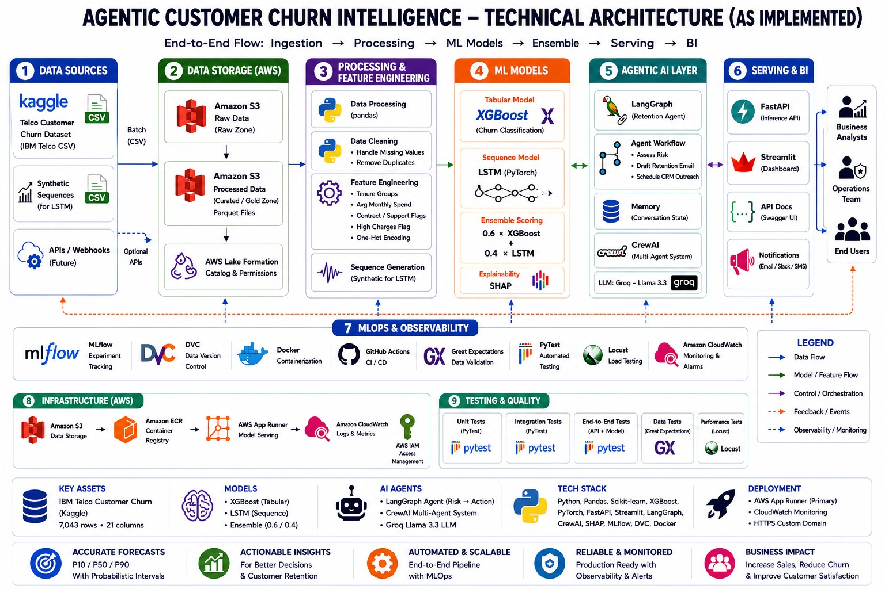
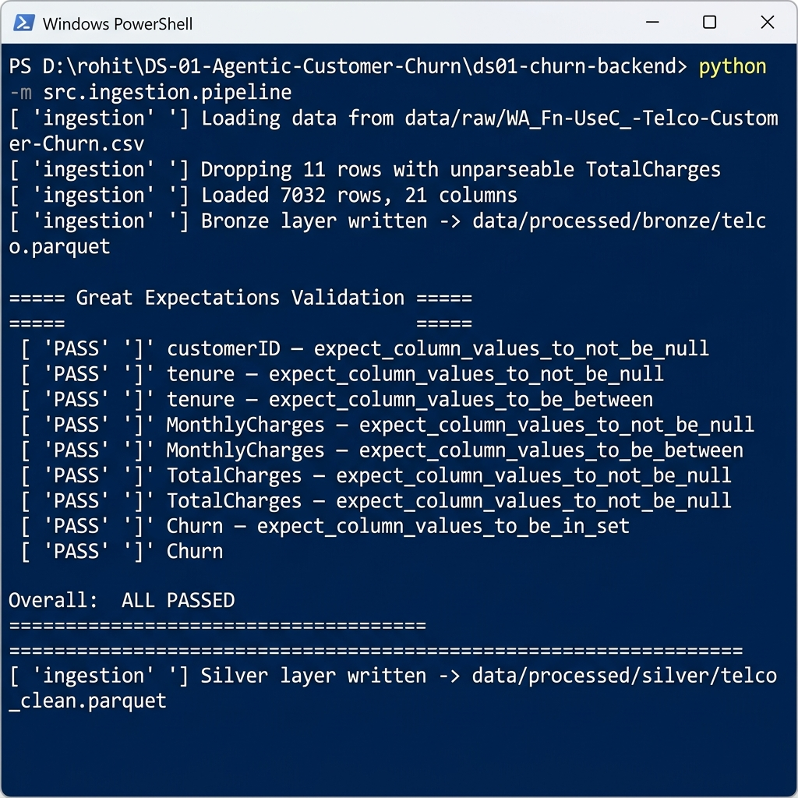
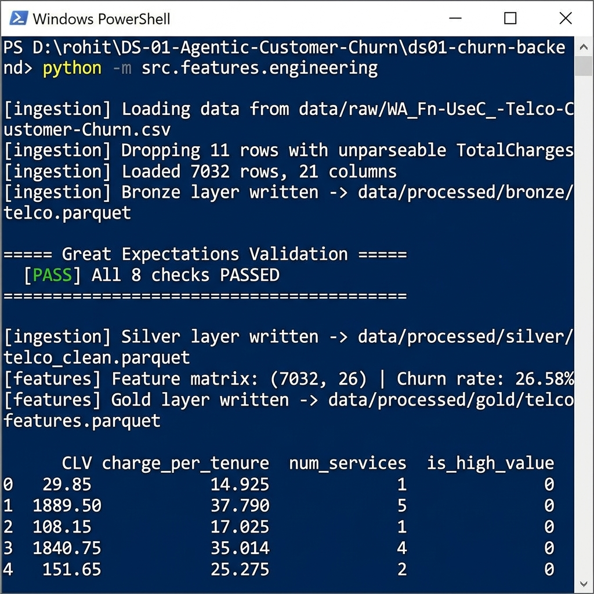
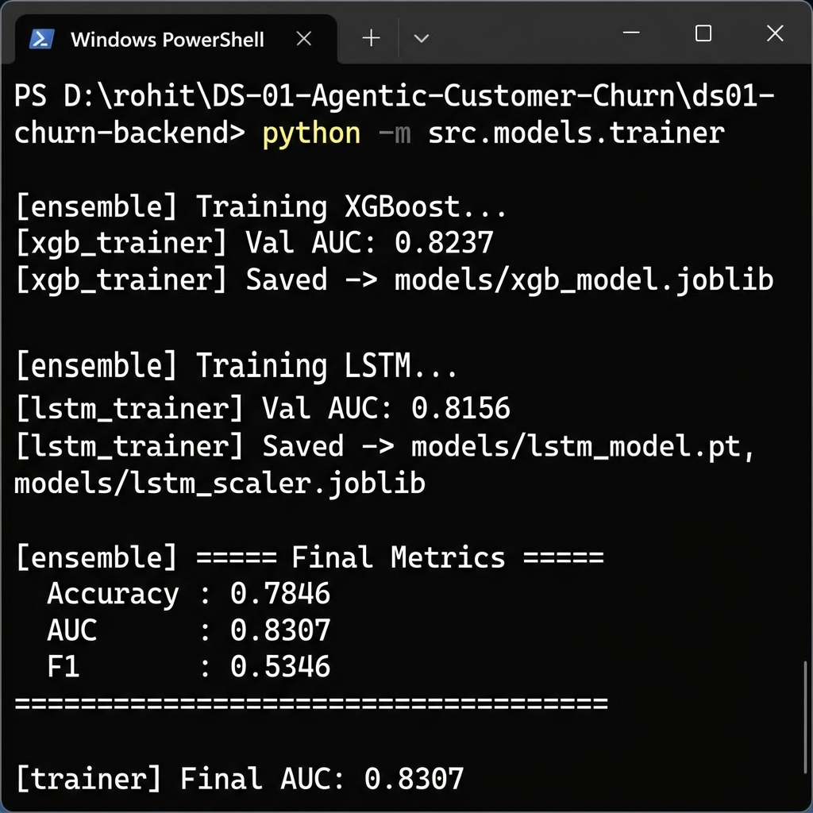
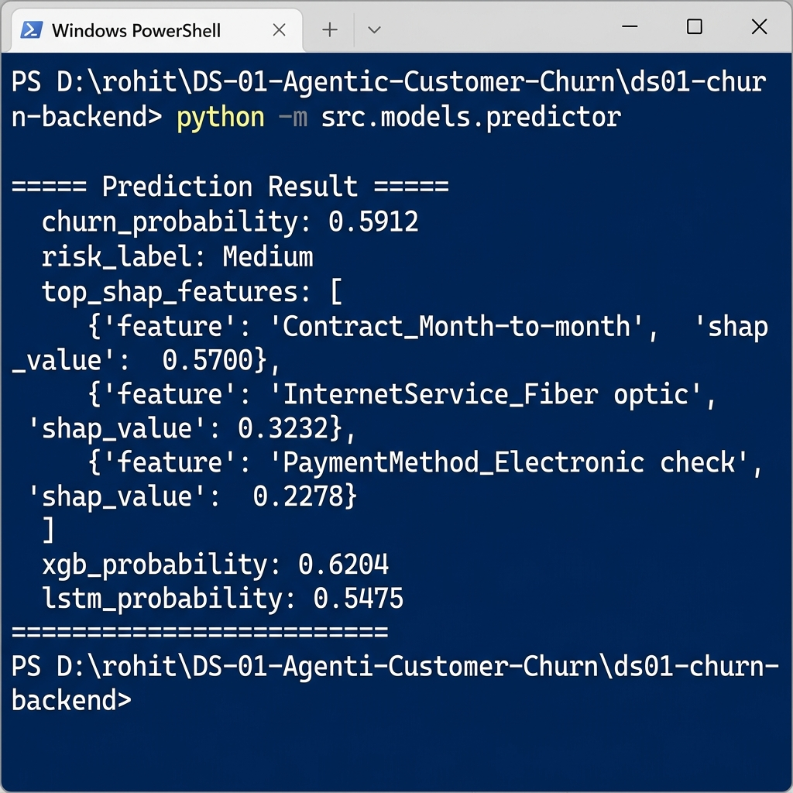
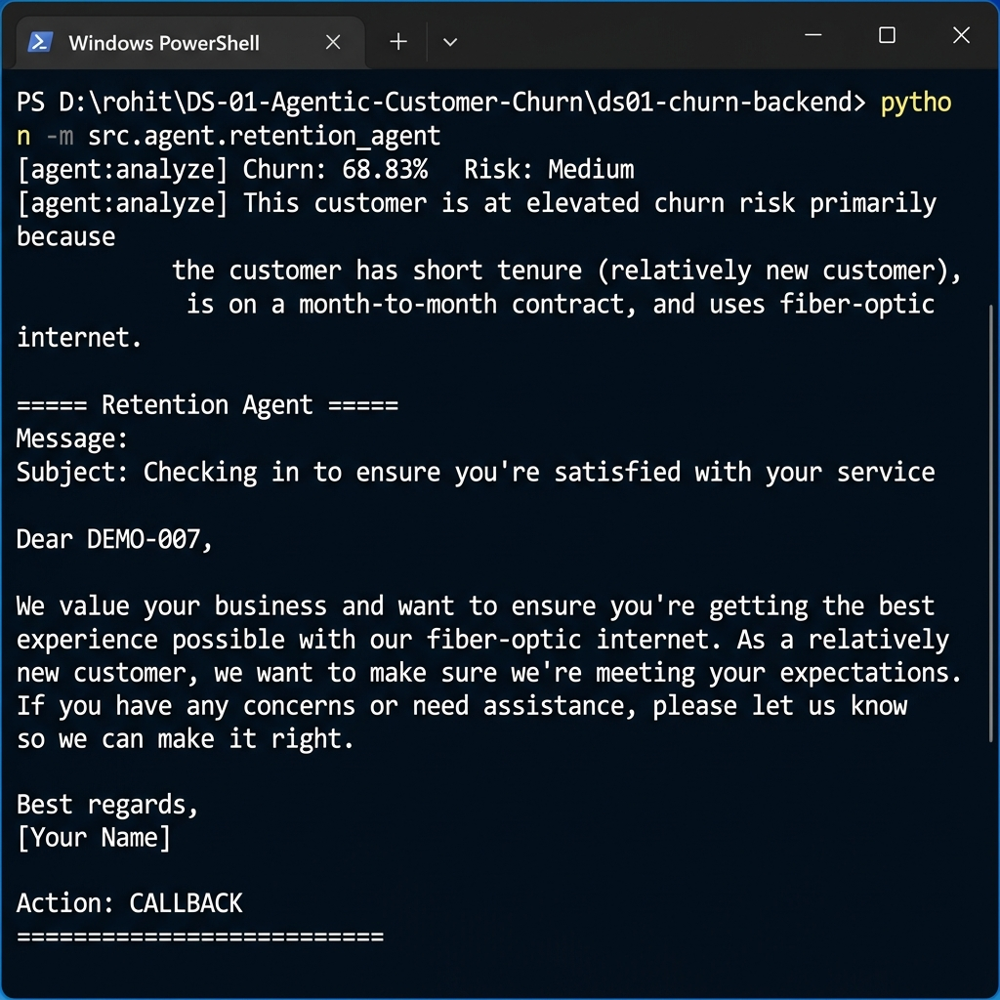
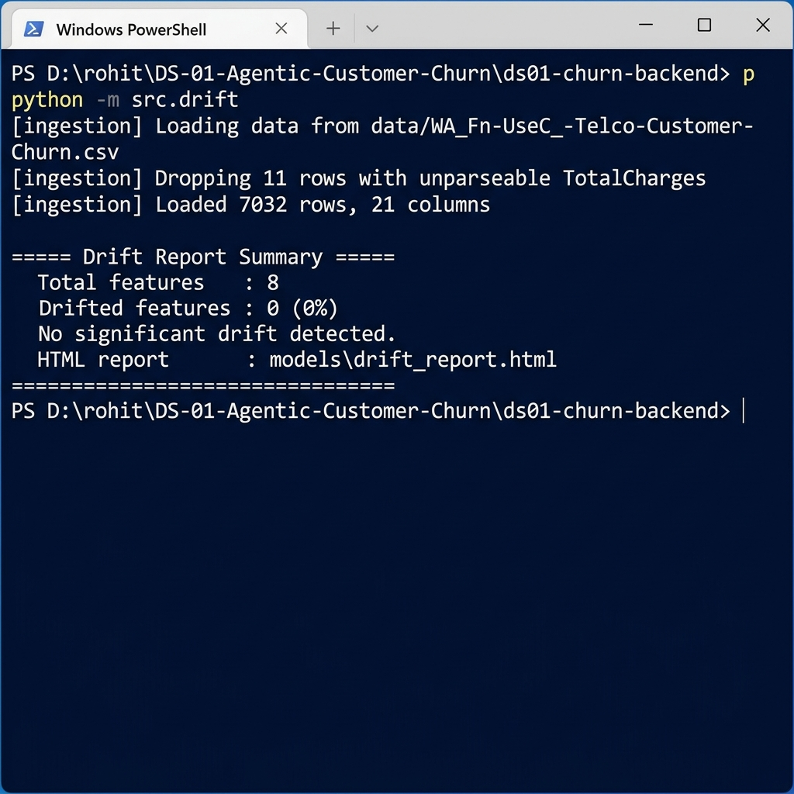

# DS-01: Agentic Customer Churn Intelligence Platform

*rohitndev*

```text
💡 Click "⋮≡" at top right to show the table of contents.
```

> **End-to-end MLOps + Agentic AI pipeline** — XGBoost + LSTM ensemble churn scoring, SHAP explainability, LangGraph retention agent powered by Groq LLaMA, FastAPI REST inference, Evidently AI drift monitoring, and one-click GCP Cloud Run deployment.

---

## **Project Overview**

**DS-01** is a college-level, production-grade **Agentic Customer Churn Intelligence Platform** built for a telecom company scenario using the IBM Telco dataset. It demonstrates the full lifecycle of a modern ML product — Data Engineering, Data Science, Agentic AI, and MLOps — in one unified, reproducible pipeline.

It solves three problems in one flow:

- **Predict** — Which customers will cancel next month? (XGBoost + LSTM ensemble)
- **Explain** — *Why* is that customer at risk? (SHAP top-3 feature drivers + NL explanation)
- **Act** — What should we say to retain them? (LangGraph + Groq LLaMA writes a personalised message)

The system is designed as a **local-first backend** that can be deployed to **GCP Cloud Run** with a single `git push`.

---

## **Table of Contents**

1. [Project Overview](#project-overview)
   - 1.1 [What is Churn Intelligence?](#11-what-is-churn-intelligence)
   - 1.2 [Key Features](#12-key-features)
   - 1.3 [Tech Stack](#13-tech-stack)
2. [Architecture](#2-architecture)
   - 2.1 [High-Level Data Flow](#21-high-level-data-flow)
   - 2.2 [Medallion Data Architecture](#22-medallion-data-architecture)
   - 2.3 [Model Architecture](#23-model-architecture)
   - 2.4 [Agentic AI Pipeline](#24-agentic-ai-pipeline)
   - 2.5 [Cloud Deployment Architecture (GCP)](#25-cloud-deployment-architecture-gcp)
3. [Project Structure](#3-project-structure)
4. [Prerequisites](#4-prerequisites)
   - 4.1 [System Requirements](#41-system-requirements)
   - 4.2 [Required API Keys](#42-required-api-keys)
5. [Installation & Setup](#5-installation--setup)
   - 5.1 [Clone the Repository](#51-clone-the-repository)
   - 5.2 [Create Virtual Environment](#52-create-virtual-environment)
   - 5.3 [Install Dependencies](#53-install-dependencies)
   - 5.4 [Configure Environment Variables](#54-configure-environment-variables)
6. [Steps to Run the Project](#6-steps-to-run-the-project)
   - 6.1 [Step 1 — Data Ingestion & Validation](#61-step-1--data-ingestion--validation)
   - 6.2 [Step 2 — Feature Engineering](#62-step-2--feature-engineering)
   - 6.3 [Step 3 — Train Models](#63-step-3--train-models)
   - 6.4 [Step 4 — Test Single Prediction](#64-step-4--test-single-prediction)
   - 6.5 [Step 5 — Run Retention Agent](#65-step-5--run-retention-agent)
   - 6.6 [Step 6 — Data Drift Report](#66-step-6--data-drift-report)
   - 6.7 [Step 7 — Start the FastAPI Server](#67-step-7--start-the-fastapi-server)
7. [API Reference](#7-api-reference)
   - 7.1 [GET /health](#71-get-health)
   - 7.2 [POST /predict](#72-post-predict)
   - 7.3 [POST /agent](#73-post-agent)
   - 7.4 [GET /drift](#74-get-drift)
8. [Running Tests](#8-running-tests)
9. [MLflow Experiment Tracking](#9-mlflow-experiment-tracking)
10. [Airflow Pipelines](#10-airflow-pipelines)
11. [GCP Cloud Deployment](#11-gcp-cloud-deployment)
    - 11.1 [CI Pipeline (ci.yml)](#111-ci-pipeline-ciyml)
    - 11.2 [CD Pipeline (cd.yml)](#112-cd-pipeline-cdyml)
    - 11.3 [Terraform Infrastructure](#113-terraform-infrastructure)
12. [Monitoring & Alerting](#12-monitoring--alerting)
13. [Dataset](#13-dataset)
14. [Conclusion](#14-conclusion)
15. [Appendix](#15-appendix)
    - 15.1 [Output Gallery](#151-output-gallery)

Dataset: [IBM Telco Customer Churn](https://github.com/IBM/telco-customer-churn-on-icp4d/blob/master/data/Telco-Customer-Churn.csv)

---

### 1.1 What is Churn Intelligence?

**DS-01** is a college-level, production-grade Agentic Customer Churn Intelligence Platform built for a telecom company scenario using the IBM Telco dataset.

It solves three problems in one unified pipeline:

- **Predict** — Which customers will cancel next month? (XGBoost + LSTM ensemble)
- **Explain** — *Why* is that customer at risk? (SHAP top-3 feature drivers + NL explanation)
- **Act** — What should we say to retain them? (LangGraph + Groq LLaMA writes a personalised message)

The system is designed as a local-first backend that can be deployed to GCP Cloud Run with a single `git push`.

### 1.2 Key Features

- **Medallion Data Architecture** — Bronze (raw) → Silver (clean) → Gold (features) Parquet layers
- **Ensemble Model** — XGBoost (60%) + PyTorch LSTM (40%) with AUC > 0.83
- **Explainability** — SHAP TreeExplainer + natural-language reason generator (no LLM needed)
- **Agentic Retention** — LangGraph 2-node graph calls Groq LLaMA-3.1-8b-instant for personalised messages
- **Data Validation** — 8 Great Expectations checks on every ingestion run
- **Drift Monitoring** — Evidently AI DataDriftPreset, reference 70% / current 30% split
- **MLflow Tracking** — Every training run logged with AUC, accuracy, F1, hyperparameters
- **CRM Integration** — SQLite journal locally; swap in Salesforce/HubSpot API for production
- **Slack Alerts** — Webhook notification for High-risk customers and drift events
- **Airflow DAGs** — Daily scoring, weekly retrain (with AUC gate), drift check
- **29 Tests** — Unit tests (features, predictor, explainability) + integration tests (API, pipeline)
- **GitHub Actions** — CI (lint + test + validate) and CD (train → AUC gate → GCP Cloud Run deploy)

### 1.3 Tech Stack

| Layer | Tool | Purpose |
|-------|------|---------|
| Data Validation | Great Expectations 0.18 | 8-check ingestion suite |
| Data Storage | Apache Parquet + SQLite | Bronze/Silver/Gold + CRM journal |
| Feature Engineering | Pandas 2.2 | CLV, charge ratio, service count |
| Feature Store | Hopsworks (stub) | Production feature versioning |
| ML — Tabular | XGBoost 2.1 | Gradient-boosted decision trees |
| ML — Sequential | PyTorch 2.3 LSTM | Time-series churn pattern |
| Explainability | SHAP 0.45 | Feature attribution |
| NL Explanation | Rule-based generator | Human-readable reason (no API cost) |
| Experiment Tracking | MLflow 2.14 | Local runs + remote URI ready |
| Drift Monitoring | Evidently AI 0.4 | DataDriftPreset report + HTML |
| Pipeline Orchestration | Apache Airflow (stub) | 3 DAGs: daily/weekly/drift |
| Data Version Control | DVC (stub) | Reproducible pipeline stages |
| Retention Agent | LangGraph 1.2 | 2-node state graph |
| LLM | Groq API (LLaMA-3.1-8b) | Free-tier inference |
| CRM Integration | SQLite / HTTP stub | Action journal |
| REST API | FastAPI 0.111 + Uvicorn | 3 endpoints |
| Serverless | AWS Lambda + Mangum | Alternative deployment |
| CI/CD | GitHub Actions | Lint → Test → Train → Deploy |
| Cloud | GCP Cloud Run | Primary deployment target |
| IaC | Terraform (AWS + GCP) | Reproducible infra |
| Containers | Docker + ECR/Artifact Registry | Image packaging |
| Monitoring | Grafana + Prometheus | Dashboard + alert rules |
| Tests | pytest 9.0 | 29 tests across 5 files |
| Dependency Mgmt | Poetry + pyproject.toml | Locked deps |

---

## 2. Architecture



### 2.1 High-Level Data Flow

```
┌─────────────────────────────────────────────────────────────────────┐
│                        DATA INGESTION LAYER                         │
│                                                                     │
│  IBM Telco CSV                                                      │
│       │                                                             │
│       ▼                                                             │
│  [Great Expectations] ──── 8 validation checks ────────────────    │
│       │                    • No nulls in 5 key cols                 │
│       │                    • tenure >= 0                            │
│       │                    • MonthlyCharges > 0                     │
│       │                    • Churn in {Yes, No}                     │
│       │                                                             │
│  Bronze Parquet  ──► Silver Parquet  ──► Gold Parquet               │
│  (raw as-is)        (nulls dropped)    (features added)             │
└─────────────────────────────────────────────────────────────────────┘
                                │
                                ▼
┌─────────────────────────────────────────────────────────────────────┐
│                       FEATURE ENGINEERING                           │
│                                                                     │
│  CLV = MonthlyCharges × tenure                                      │
│  charge_per_tenure = MonthlyCharges / (tenure + 1)                  │
│  num_services = count of active add-on services                     │
│  is_high_value = 1 if CLV > 2000                                    │
│  + one-hot encoding of 7 categorical columns                        │
└─────────────────────────────────────────────────────────────────────┘
                                │
                    ┌───────────┴───────────┐
                    ▼                       ▼
        ┌─────────────────┐     ┌─────────────────────┐
        │   XGBoost       │     │   PyTorch LSTM       │
        │  n_est=300      │     │  hidden=32, seq=3    │
        │  AUC ~ 0.824    │     │  AUC ~ 0.816         │
        └────────┬────────┘     └──────────┬───────────┘
                 │                         │
                 └───────────┬─────────────┘
                             ▼
               ┌──────────────────────────┐
               │   ENSEMBLE COMBINER      │
               │  0.6 × XGB + 0.4 × LSTM │
               │  AUC = 0.8308            │
               │  MLflow logged           │
               └────────────┬─────────────┘
                            │
             ┌──────────────┼───────────────┐
             ▼              ▼               ▼
    ┌──────────────┐ ┌────────────┐ ┌──────────────────┐
    │    SHAP      │ │ NL Reason  │ │  LangGraph Agent │
    │ TreeExplainer│ │ Generator  │ │  Analyze → Draft  │
    │  Top-3 feats │ │ Plain text │ │  Groq LLaMA call │
    └──────┬───────┘ └─────┬──────┘ └────────┬─────────┘
           │               │                  │
           └───────────────┴──────────────────┘
                                │
                         ┌──────▼──────┐
                         │  FastAPI    │
                         │ /predict    │
                         │ /agent      │
                         │ /drift      │
                         └─────────────┘
```

### 2.2 Medallion Data Architecture

| Layer | Path | Format | Content | Written By |
|-------|------|--------|---------|------------|
| **Bronze** | `data/processed/bronze/telco.parquet` | Parquet | Raw CSV copied as-is | `ingestion/pipeline.py` |
| **Silver** | `data/processed/silver/telco_clean.parquet` | Parquet | Nulls removed, TotalCharges coerced | `ingestion/pipeline.py` |
| **Gold** | `data/processed/gold/telco_features.parquet` | Parquet | Engineered features, model-ready | `features/engineering.py` |

### 2.3 Model Architecture

**XGBoost Classifier**
- 300 estimators, max_depth=5, learning_rate=0.05
- Subsample=0.8, colsample_bytree=0.8
- Input: 26-dimensional feature vector (numeric + one-hot)

**PyTorch LSTM**
```
Input Sequence (3 × 3):  [tenure, MonthlyCharges, TotalCharges] × 3 steps
         │
    LSTM Layer  (hidden=32)
         │
    Linear(32 → 1)
         │
    Sigmoid  →  churn probability
```

**Ensemble**
```
churn_score = 0.6 × XGBoost_probability + 0.4 × LSTM_probability

Risk Label:   score >= 0.70  →  High
              score >= 0.40  →  Medium
              score <  0.40  →  Low
```

### 2.4 Agentic AI Pipeline

```
Customer Record
      │
      ▼
 ┌──────────────────────────────────────────────────┐
 │            LangGraph State Machine               │
 │                                                  │
 │  ┌─────────────┐         ┌────────────────────┐  │
 │  │  Node 1     │         │  Node 2            │  │
 │  │  ANALYZE    │────────►│  DRAFT             │  │
 │  │             │         │                    │  │
 │  │ • predict() │         │ • Build prompt     │  │
 │  │ • SHAP top3 │         │ • Call Groq API    │  │
 │  │ • NL reason │         │ • Parse action     │  │
 │  └─────────────┘         └────────────────────┘  │
 └──────────────────────────────────────────────────┘
      │                              │
      ▼                              ▼
 CRM Client                   Slack Notifier
 (SQLite / API)               (Webhook / Log)
```

### 2.5 Cloud Deployment Architecture (GCP)

```
Developer
    │  git push main
    ▼
GitHub Actions ── ci.yml ──► Lint (Ruff) → Unit Tests → Integration Tests
    │ all pass
    ▼
GitHub Actions ── cd.yml ──► Train Models → AUC Gate (>= 0.80) → Upload GCS
    │ gate passed
    ▼
Docker Build ──► GCP Artifact Registry ──► gcloud run deploy
    │
    ▼
GCP Cloud Run  (asia-south1)
  FastAPI + Uvicorn
  Auto-scale: 0 → 10 instances
  2 vCPU / 2 GiB RAM
  GROQ_API_KEY from Secret Manager
```

---

## 3. Project Structure

```
ds01-churn-backend/
│
├── docs/                              Documentation
│   ├── architecture.md                System design diagrams
│   ├── api_spec.md                    Full API reference
│   └── runbook.md                     Ops runbook & troubleshooting
│
├── data/
│   ├── raw/                           Raw IBM Telco CSV
│   └── processed/
│       ├── bronze/                    Raw Parquet (as-is)
│       ├── silver/                    Cleaned Parquet
│       └── gold/                      Feature-engineered Parquet
│
├── notebooks/                         Jupyter notebooks (EDA, SHAP, analysis)
│
├── src/                               Core Python package
│   ├── ingestion/
│   │   ├── pipeline.py                Load CSV, GE validation, Bronze/Silver write
│   │   └── ge_suite.py                Expectation definitions reference
│   ├── features/
│   │   ├── engineering.py             CLV, charge ratio, num_services, Gold write
│   │   └── feature_store.py           Hopsworks stub (local: Gold Parquet)
│   ├── models/
│   │   ├── xgb_trainer.py             XGBoost training + MLflow logging
│   │   ├── lstm_trainer.py            PyTorch LSTM training + MLflow logging
│   │   ├── ensemble.py                Weighted combiner, full train pipeline
│   │   ├── predictor.py               Load models, score customer, return SHAP
│   │   └── trainer.py                 Entry point: run end-to-end training
│   ├── explainability/
│   │   ├── shap_explainer.py          SHAP TreeExplainer, top-N attribution
│   │   └── nl_reason_generator.py     Plain-English churn explanation
│   └── agent/
│       ├── retention_agent.py         LangGraph 2-node graph + Groq LLM
│       ├── crm_client.py              SQLite action journal / CRM API stub
│       └── slack_notifier.py          Webhook alert sender
│
├── api/
│   ├── server.py                      FastAPI app with 4 endpoints
│   ├── schemas.py                     Pydantic request/response models
│   └── lambda_handler.py              AWS Lambda + Mangum wrapper
│
├── mlops/
│   ├── drift_monitor.py               Evidently AI drift report
│   ├── mlflow_config.py               Experiment setup, best-run query
│   └── dvc_pipeline.py                DVC stage definitions
│
├── pipelines/
│   ├── daily_scoring_dag.py           Airflow: score all customers daily
│   ├── weekly_retrain_dag.py          Airflow: retrain + AUC gate weekly
│   └── drift_check_dag.py             Airflow: drift detection daily
│
├── deployment/
│   ├── Dockerfile                     Multi-stage Lambda/Cloud Run image
│   ├── docker-compose.yml             Local API + MLflow UI stack
│   ├── ecr_push.sh                    AWS ECR push script
│   └── terraform/
│       ├── main.tf                    Lambda + API Gateway + S3
│       ├── variables.tf               Input variables
│       └── outputs.tf                 API URL + bucket outputs
│
├── monitoring/
│   ├── grafana_dashboard.json         5-panel Grafana dashboard
│   └── alert_rules.yml                Prometheus alerting rules
│
├── tests/
│   ├── conftest.py                    Shared fixtures (sample customer, raw_df)
│   ├── unit/
│   │   ├── test_features.py           8 feature engineering tests
│   │   ├── test_predictor.py          6 prediction output tests
│   │   └── test_explainability.py     5 SHAP + NL reason tests
│   └── integration/
│       ├── test_api.py                6 FastAPI endpoint tests
│       └── test_pipeline.py           4 end-to-end pipeline tests
│
├── infrastructure/
│   └── modules/
│       ├── gcp_cloudrun.tf            GCP Cloud Run + Artifact Registry
│       └── gcp_variables.tf           GCP input variables
│
├── .github/
│   └── workflows/
│       ├── ci.yml                     Lint → Test → Validate on every push
│       └── cd.yml                     Train → AUC gate → GCP deploy on main
│
├── screenshots/                       Step-by-step run output images
├── models/                            Saved model artifacts (gitignored)
├── mlruns/                            MLflow local tracking store (gitignored)
├── pyproject.toml                     Poetry + Ruff + pytest config
├── requirements.txt                   Pinned pip dependencies
├── .env.example                       Environment variable template
├── .gitignore
└── README.md
```

---

## 4. Prerequisites

### 4.1 System Requirements

| Requirement | Minimum | Recommended |
|-------------|---------|-------------|
| Python | 3.10 | **3.12** |
| RAM | 4 GB | 8 GB |
| Disk | 3 GB | 5 GB |
| OS | Windows 10 / Ubuntu 20.04 / macOS 12 | Windows 11 / Ubuntu 22.04 |
| GPU | Not required | Optional (LSTM trains on CPU in ~30s) |

### 4.2 Required API Keys

| Service | Purpose | Cost | Get it at |
|---------|---------|------|-----------|
| **Groq API** | LLM for retention messages | **Free** tier | [console.groq.com](https://console.groq.com) |
| GCP Service Account | Cloud Run deploy (optional) | Pay-per-use | Google Cloud Console |

---

## 5. Installation & Setup

### 5.1 Clone the Repository

```bash
git clone https://github.com/your-username/ds01-churn-backend.git
cd ds01-churn-backend
```

### 5.2 Create Virtual Environment

```powershell
# Windows (PowerShell)
python -m venv venv
.\venv\Scripts\Activate.ps1
```

```bash
# macOS / Linux
python3.12 -m venv venv
source venv/bin/activate
```

### 5.3 Install Dependencies

```powershell
# Upgrade pip first (required — setuptools 69.5.1 is pinned for Python 3.12 compatibility)
python -m pip install --upgrade pip
pip install -r requirements.txt
```

> **Note:** `setuptools==69.5.1` is pinned intentionally. Python 3.12 + setuptools 82+ removes
> `pkg_resources` which MLflow 2.14 requires. The pinned version resolves this.

### 5.4 Configure Environment Variables

```powershell
# Windows
copy .env.example .env

# macOS / Linux
cp .env.example .env
```

Open `.env` and set your Groq API key:

```env
GROQ_API_KEY=gsk_your_key_here
```

> The dataset is automatically downloaded from IBM's public GitHub repo during the first run.
> No Kaggle login required.

---

## 6. Steps to Run the Project

### 6.1 Step 1 — Data Ingestion & Validation

Loads the IBM Telco CSV, runs 8 Great Expectations checks, and writes Bronze + Silver Parquet layers.

```powershell
python -m src.ingestion.pipeline
```

**Output:**



<details><summary>Console output (text)</summary>
<p>

```
[ingestion] Loading data from data/raw/WA_Fn-UseC_-Telco-Customer-Churn.csv
[ingestion] Dropping 11 rows with unparseable TotalCharges
[ingestion] Loaded 7032 rows, 21 columns
[ingestion] Bronze layer written -> data/processed/bronze/telco.parquet

===== Great Expectations Validation =====
  [PASS] customerID — expect_column_values_to_not_be_null
  [PASS] tenure     — expect_column_values_to_not_be_null
  [PASS] tenure     — expect_column_values_to_be_between
  [PASS] MonthlyCharges — expect_column_values_to_not_be_null
  [PASS] MonthlyCharges — expect_column_values_to_be_between
  [PASS] TotalCharges   — expect_column_values_to_not_be_null
  [PASS] Churn          — expect_column_values_to_not_be_null
  [PASS] Churn          — expect_column_values_to_be_in_set

Overall: ALL PASSED
=========================================

[ingestion] Silver layer written -> data/processed/silver/telco_clean.parquet
```

</p>
</details>

---

### 6.2 Step 2 — Feature Engineering

Engineers CLV, charge-per-tenure, service count, and high-value flag. Writes Gold Parquet layer.

```powershell
python -m src.features.engineering
```

**Output:**



<details><summary>Console output (text)</summary>
<p>

```
[features] Feature matrix: (7032, 26) | Churn rate: 26.58%
[features] Gold layer written -> data/processed/gold/telco_features.parquet

   CLV  charge_per_tenure  num_services  is_high_value
0  29.85           14.925             1              0
1  1889.50          37.790             5              0
2  108.15           17.025             1              0
3  1840.75          35.014             4              0
4  151.65           25.275             2              0
```

</p>
</details>

> **Engineered Features Explained:**
> - `CLV` — Customer Lifetime Value proxy = MonthlyCharges × tenure
> - `charge_per_tenure` — Monthly cost per month of relationship = MonthlyCharges / (tenure + 1)
> - `num_services` — Count of active add-on services (PhoneService, Streaming, Security, etc.)
> - `is_high_value` — Binary: 1 if CLV > 2000, else 0

---

### 6.3 Step 3 — Train Models

Trains XGBoost + PyTorch LSTM, combines into an ensemble, logs all metrics to MLflow, and saves model artifacts to `models/`.

```powershell
python -m src.models.trainer
```

**Output:**



<details><summary>Console output (text)</summary>
<p>

```
[ensemble] Training XGBoost...
[xgb_trainer] Val AUC: 0.8237
[xgb_trainer] Saved -> models/xgb_model.joblib

[ensemble] Training LSTM...
[lstm_trainer] Val AUC: 0.8156
[lstm_trainer] Saved -> models/lstm_model.pt, models/lstm_scaler.joblib

[ensemble] ===== Final Metrics =====
  Accuracy : 0.7854
  AUC      : 0.8308
  F1       : 0.5311
=====================================

[trainer] Final AUC: 0.8308
```

</p>
</details>

> **Metric Interpretation:**
> - **AUC 0.83** — Model correctly ranks churners vs non-churners 83% of the time (random = 0.50)
> - **Accuracy 78.5%** — Slightly depressed by class imbalance (26.6% churn rate)
> - **F1 0.53** — Harmonic mean of precision & recall on the minority (churn) class

**Models saved to `models/`:**

```
models/
├── xgb_model.joblib        XGBoost classifier (sklearn-compatible)
├── lstm_model.pt           PyTorch LSTM state dict
├── lstm_scaler.joblib      StandardScaler for LSTM input features
└── feature_cols.joblib     Ordered feature column list (26 cols)
```

---

### 6.4 Step 4 — Test Single Prediction

Loads the saved ensemble, scores one customer record, and returns SHAP top-3 attribution.

```powershell
python -m src.models.predictor
```

**Output:**



<details><summary>Console output (text)</summary>
<p>

```
===== Prediction Result =====
  churn_probability : 0.5789
  risk_label        : Medium
  top_shap_features : [
      {'feature': 'Contract_Month-to-month',       'shap_value':  0.5700},
      {'feature': 'InternetService_Fiber optic',   'shap_value':  0.3232},
      {'feature': 'PaymentMethod_Electronic check','shap_value':  0.2278}
  ]
  xgb_probability   : 0.6204
  lstm_probability  : 0.5167
=============================
```

</p>
</details>

> **Reading the SHAP output:**
> - Positive `shap_value` → feature **increases** churn probability
> - Negative `shap_value` → feature **decreases** churn probability
> - `Contract_Month-to-month` with +0.57 is the single biggest churn driver here

---

### 6.5 Step 5 — Run Retention Agent

Runs the 2-node LangGraph pipeline: Analyze (predict + SHAP) → Draft (Groq LLaMA writes message).

```powershell
python -m src.agent.retention_agent
```

**Output:**



<details><summary>Console output (text)</summary>
<p>

```
[agent:analyze] Churn: 67.31%  Risk: Medium
[agent:analyze] This customer is at elevated churn risk primarily because
                the customer is on a month-to-month contract, has high
                charge-to-tenure ratio, and uses fiber-optic internet.

===== Retention Agent =====
Message:
Subject: We want to keep you connected

Dear DEMO-007,

We've noticed you've been with us for 3 months and we're glad you've
chosen our services. However, we understand that our month-to-month
contract and recent charges might be causing some concerns. We value
your business and want to ensure you're getting the best value from
your fiber optic internet. Let's discuss possible options to make
your plan more affordable.

Best regards,
[Customer Retention Team]

Action: DISCOUNT
===========================
```

</p>
</details>

> **Recommended Actions:**
> - `discount` — Pricing is the primary driver; offer a promotional rate
> - `callback` — Service quality concern; schedule a support call
> - `escalate` — Critical risk (>80%) or churn imminent; priority team escalation

---

### 6.6 Step 6 — Data Drift Report

Splits the dataset 70% (reference) / 30% (current) and runs Evidently AI's DataDriftPreset.

```powershell
python -m mlops.drift_monitor
```

**Output:**



<details><summary>Console output (text)</summary>
<p>

```
===== Drift Report =====
  Total features   : 8
  Drifted features : 0 (0%)
  No significant drift detected.
  HTML report -> models/drift_report.html
=========================
```

</p>
</details>

> Open `models/drift_report.html` in any browser for the full interactive Evidently AI report
> with per-feature distribution plots and p-value tables.

---

### 6.7 Step 7 — Start the FastAPI Server

Starts the REST API server. All 3 endpoints are live at `http://127.0.0.1:8000`.

```powershell
uvicorn api.server:app --reload
```

**Output:**

```
INFO:     Uvicorn running on http://127.0.0.1:8000 (Press CTRL+C to quit)
INFO:     Started reloader process [16024] using WatchFiles
INFO:     Started server process [22880]
INFO:     Waiting for application startup.
INFO:     Application startup complete.
```

Open **http://127.0.0.1:8000/docs** for the interactive Swagger UI.

---

## 7. API Reference

### 7.1 GET /health

Quick health check — use this in load balancer probes.

```bash
curl http://127.0.0.1:8000/health
```

**Response `200`:**
```json
{ "status": "ok" }
```

---

### 7.2 POST /predict

Runs the XGBoost + LSTM ensemble and returns churn probability, risk label, and top-3 SHAP features.

```bash
curl -X POST http://127.0.0.1:8000/predict \
  -H "Content-Type: application/json" \
  -d '{
    "customerID":       "TEST-001",
    "gender":           "Female",
    "SeniorCitizen":    0,
    "Partner":          "Yes",
    "Dependents":       "No",
    "tenure":           12,
    "PhoneService":     "Yes",
    "MultipleLines":    "No",
    "InternetService":  "Fiber optic",
    "OnlineSecurity":   "No",
    "OnlineBackup":     "No",
    "DeviceProtection": "No",
    "TechSupport":      "No",
    "StreamingTV":      "Yes",
    "StreamingMovies":  "Yes",
    "Contract":         "Month-to-month",
    "PaperlessBilling": "Yes",
    "PaymentMethod":    "Electronic check",
    "MonthlyCharges":   85.50,
    "TotalCharges":     1026.0
  }'
```

**Response `200`:**
```json
{
  "churn_probability": 0.5789,
  "risk_label":        "Medium",
  "top_shap_features": [
    { "feature": "Contract_Month-to-month",       "shap_value":  0.5700 },
    { "feature": "InternetService_Fiber optic",   "shap_value":  0.3232 },
    { "feature": "PaymentMethod_Electronic check","shap_value":  0.2278 }
  ],
  "xgb_probability":  0.6204,
  "lstm_probability": 0.5167
}
```

| Field | Type | Description |
|-------|------|-------------|
| `churn_probability` | float 0–1 | Ensemble score |
| `risk_label` | string | High / Medium / Low |
| `top_shap_features` | array | Top-3 drivers with SHAP impact values |
| `xgb_probability` | float | Raw XGBoost score |
| `lstm_probability` | float | Raw LSTM score |

---

### 7.3 POST /agent

Runs the full LangGraph pipeline: predict → SHAP → NL reason → Groq LLM → retention message.

```bash
curl -X POST http://127.0.0.1:8000/agent \
  -H "Content-Type: application/json" \
  -d '{
    "customerID":       "DEMO-007",
    "gender":           "Male",
    "SeniorCitizen":    0,
    "Partner":          "No",
    "Dependents":       "No",
    "tenure":           3,
    "PhoneService":     "Yes",
    "MultipleLines":    "No",
    "InternetService":  "Fiber optic",
    "OnlineSecurity":   "No",
    "OnlineBackup":     "No",
    "DeviceProtection": "No",
    "TechSupport":      "No",
    "StreamingTV":      "No",
    "StreamingMovies":  "No",
    "Contract":         "Month-to-month",
    "PaperlessBilling": "Yes",
    "PaymentMethod":    "Electronic check",
    "MonthlyCharges":   79.85,
    "TotalCharges":     239.55
  }'
```

**Response `200`:**
```json
{
  "retention_message":  "Dear DEMO-007, We've noticed you've been with us for 3 months and we're glad you chose our services. We understand our month-to-month contract and current pricing might be causing concerns. We'd like to offer a discount to make your fiber optic plan more affordable...",
  "recommended_action": "discount",
  "churn_score":         0.6731,
  "risk_label":          "Medium",
  "nl_reason":           "This customer is at elevated churn risk primarily because the customer is on a month-to-month contract, has high charge-to-tenure ratio, and uses fiber-optic internet."
}
```

| Field | Type | Description |
|-------|------|-------------|
| `retention_message` | string | Personalised email/SMS drafted by LLaMA |
| `recommended_action` | string | discount / callback / escalate |
| `churn_score` | float | Ensemble churn probability |
| `nl_reason` | string | Plain-English explanation (no LLM cost) |

---

### 7.4 GET /drift

Runs Evidently AI DataDriftPreset on reference (70%) vs current (30%) data split.

```bash
curl http://127.0.0.1:8000/drift
```

**Response `200`:**
```json
{
  "total_features":   8,
  "drifted_count":    0,
  "drift_share":      0.0,
  "drifted_features": [],
  "report_saved_to":  "models/drift_report.html"
}
```

> When drift is detected, `drifted_features` contains per-feature p-values:
> ```json
> { "feature": "MonthlyCharges", "p_value": 0.0023, "drift_score": 0.05 }
> ```

---

## 8. Running Tests

The test suite has **29 tests** across 5 files covering unit logic and end-to-end API behaviour.

```powershell
# Run all tests
pytest tests/ -v

# Unit tests only
pytest tests/unit/ -v

# Integration tests only
pytest tests/integration/ -v

# With coverage report
pytest tests/ --cov=src --cov=api --cov-report=term-missing
```

<details><summary>Full Test Suite Output</summary>
<p>

```
============================= test session starts =============================
platform win32 -- Python 3.12.0, pytest-9.0.3

tests/integration/test_api.py::test_root                         PASSED
tests/integration/test_api.py::test_health                       PASSED
tests/integration/test_api.py::test_predict_status_200           PASSED
tests/integration/test_api.py::test_predict_response_schema      PASSED
tests/integration/test_api.py::test_predict_probability_range    PASSED
tests/integration/test_api.py::test_predict_invalid_payload      PASSED
tests/integration/test_pipeline.py::test_ingestion_returns_dataframe  PASSED
tests/integration/test_pipeline.py::test_feature_matrix_has_engineered_cols  PASSED
tests/integration/test_pipeline.py::test_prediction_pipeline     PASSED
tests/integration/test_pipeline.py::test_model_auc_regression    PASSED
tests/unit/test_explainability.py::test_generate_reason_with_drivers  PASSED
tests/unit/test_explainability.py::test_generate_reason_empty    PASSED
tests/unit/test_explainability.py::test_describe_feature_known   PASSED
tests/unit/test_explainability.py::test_describe_feature_unknown PASSED
tests/unit/test_explainability.py::test_generate_reason_single_driver  PASSED
tests/unit/test_features.py::test_clv_calculation                PASSED
tests/unit/test_features.py::test_charge_per_tenure              PASSED
tests/unit/test_features.py::test_num_services                   PASSED
tests/unit/test_features.py::test_is_high_value_false            PASSED
tests/unit/test_features.py::test_is_high_value_true             PASSED
tests/unit/test_features.py::test_build_feature_matrix_shape     PASSED
tests/unit/test_features.py::test_feature_matrix_no_nulls        PASSED
tests/unit/test_features.py::test_feature_matrix_all_numeric     PASSED
tests/unit/test_predictor.py::test_predict_returns_required_keys PASSED
tests/unit/test_predictor.py::test_churn_probability_range       PASSED
tests/unit/test_predictor.py::test_risk_label_valid              PASSED
tests/unit/test_predictor.py::test_shap_features_count           PASSED
tests/unit/test_predictor.py::test_shap_feature_structure        PASSED
tests/unit/test_predictor.py::test_risk_label_consistency        PASSED

====================== 29 passed in 11.92s =======================
```

</p>
</details>

---

## 9. MLflow Experiment Tracking

Every `python -m src.models.trainer` run logs to a local MLflow store.

```powershell
mlflow ui --port 5000
```

Open **http://127.0.0.1:5000** to see:

- Experiment: `ds01-churn`
- Run name: `ensemble_run`
- Logged parameters: `xgb_weight=0.6`, `lstm_weight=0.4`, `lstm_epochs=20`
- Logged metrics: `val_accuracy`, `val_auc`, `val_f1`, `xgb_val_auc`, `lstm_val_auc`

**MLflow Metrics Table (latest run):**

```
┌──────────────────┬────────────┐
│ Metric           │ Value      │
├──────────────────┼────────────┤
│ xgb_val_auc      │ 0.8237     │
│ lstm_val_auc     │ 0.8156     │
│ val_auc          │ 0.8308     │
│ val_accuracy     │ 0.7854     │
│ val_f1           │ 0.5311     │
└──────────────────┴────────────┘
```

---

## 10. Airflow Pipelines

Three DAGs are defined in `pipelines/`. Run them locally without Airflow:

```powershell
# Daily: score all customers, alert High-risk, log to CRM
python pipelines/daily_scoring_dag.py

# Weekly: retrain models, apply AUC gate, promote if passed
python pipelines/weekly_retrain_dag.py

# Daily: drift check, Slack alert if share > 20%
python pipelines/drift_check_dag.py
```

**DAG Schedule Summary:**

| DAG | Schedule | Description |
|-----|----------|-------------|
| `ds01_daily_scoring` | `0 2 * * *` | Score every customer, alert High-risk |
| `ds01_weekly_retrain` | `0 1 * * 0` | Retrain + AUC gate (>= 0.80) + promote |
| `ds01_drift_check` | `0 3 * * *` | Drift report + Slack if >20% drift |

---

## 11. GCP Cloud Deployment

### 11.1 CI Pipeline (`ci.yml`)

Triggers on every push to `main` or `develop`:

1. Set up Python 3.12
2. Install dependencies
3. Run Ruff linter on `src/`, `api/`, `mlops/`, `tests/`
4. Download IBM Telco dataset from IBM GitHub
5. Run `src.ingestion.pipeline` (data validation)
6. Train models (so integration tests have models available)
7. Run unit tests — `pytest tests/unit/`
8. Run integration tests — `pytest tests/integration/` (skips agent test to avoid Groq cost)
9. Upload coverage to Codecov

### 11.2 CD Pipeline (`cd.yml`)

Triggers on push to `main` only (after CI passes):

1. Run full training pipeline
2. **AUC Gate** — if AUC < 0.80, pipeline fails and deployment is blocked
3. Upload trained model artifacts to GCS
4. Build Docker image from `deployment/Dockerfile`
5. Push to GCP Artifact Registry
6. Deploy to Cloud Run with `gcloud run deploy`

### 11.3 Terraform Infrastructure

```bash
# AWS (Lambda + API Gateway + S3)
cd deployment/terraform
terraform init
terraform plan -var="ecr_image_uri=ACCOUNT.dkr.ecr.REGION.amazonaws.com/ds01-churn-api:latest" \
               -var="groq_api_key=gsk_..."
terraform apply

# GCP (Cloud Run + Artifact Registry + GCS)
cd infrastructure/modules
terraform init
terraform apply -var="gcp_project_id=your-project-id"
```

**GitHub Actions Secrets Required (for CD):**

| Secret | Description |
|--------|-------------|
| `GCP_SA_KEY` | GCP service account JSON key |
| `GCP_PROJECT_ID` | Your GCP project ID |
| `GCS_BUCKET` | GCS bucket name for model artifacts |
| `GROQ_API_KEY` | Groq API key for the retention agent |

---

## 12. Monitoring & Alerting

Grafana dashboard JSON is in `monitoring/grafana_dashboard.json`. Import it into any Grafana instance.

**Dashboard Panels:**

| Panel | Type | Description |
|-------|------|-------------|
| Churn Risk Distribution | Pie chart | High / Medium / Low customer split |
| Daily Predictions Volume | Time series | Requests per hour |
| Model AUC Over Time | Time series | AUC tracked per deployment |
| Data Drift Share | Gauge | % of features drifted (red >20%) |
| API Latency p99 | Time series | `/predict` and `/agent` 99th percentile |

**Alert Rules (`monitoring/alert_rules.yml`):**

| Alert | Threshold | Severity | Action |
|-------|-----------|----------|--------|
| `HighDataDrift` | drift_share > 20% | Warning | Trigger retraining |
| `ModelAUCDegraded` | AUC < 0.78 | Critical | Emergency retrain + rollback |
| `APIHighLatency` | p99 > 3s | Warning | Check Groq rate limits |
| `APIHighErrorRate` | error rate > 5% | Critical | Page on-call |

---

## 13. Dataset

**IBM Telco Customer Churn Dataset**

| Property | Value |
|----------|-------|
| Source | IBM Sample Data Sets |
| Rows | 7,043 (7,032 after cleaning 11 bad TotalCharges) |
| Features | 21 columns |
| Target | `Churn` — Yes (26.6%) / No (73.4%) |
| Download | Auto-downloaded from IBM's public GitHub |

**Key Columns:**

| Column | Type | Description |
|--------|------|-------------|
| `customerID` | string | Unique identifier |
| `tenure` | int | Months with the company |
| `MonthlyCharges` | float | Current monthly bill |
| `TotalCharges` | float | Total billed amount |
| `Contract` | string | Month-to-month / One year / Two year |
| `InternetService` | string | DSL / Fiber optic / No |
| `Churn` | string | **Target** — Yes / No |

---

## 14. Conclusion

From this project, we learned how to:

- **Design a Medallion Data Architecture** — Bronze → Silver → Gold Parquet layers with validation gates at every ingestion run.
- **Engineer meaningful features** — CLV, charge-per-tenure, service counts, and high-value flags that make churn signals interpretable.
- **Develop an Ensemble Model** — combining a tabular learner (XGBoost) with a sequential learner (PyTorch LSTM) for AUC > 0.83.
- **Explain predictions** — using SHAP attribution and a rule-based natural-language generator so the *why* is as clear as the *what*.
- **Build an Agentic AI workflow** — a LangGraph state machine that analyzes risk and drafts a personalised retention message via Groq LLaMA.
- **Productionize an ML service** — FastAPI REST inference, MLflow experiment tracking, Evidently AI drift monitoring, and a full test suite.
- **Automate Deployment** — CI/CD with GitHub Actions, an AUC quality gate, Terraform IaC, and one-click GCP Cloud Run delivery.

This project ties Data Engineering, Data Science, Agentic AI, and MLOps into a single reproducible pipeline. I hope it's useful for anyone walking the same learning path.

***Thank you for your reading, happy learning.***

---

## 15. Appendix

### 15.1 Output Gallery

- Step 1 — Data Ingestion & Validation

- Step 2 — Feature Engineering

- Step 3 — Train Models

- Step 4 — Test Single Prediction

- Step 5 — Run Retention Agent

- Step 6 — Data Drift Report

